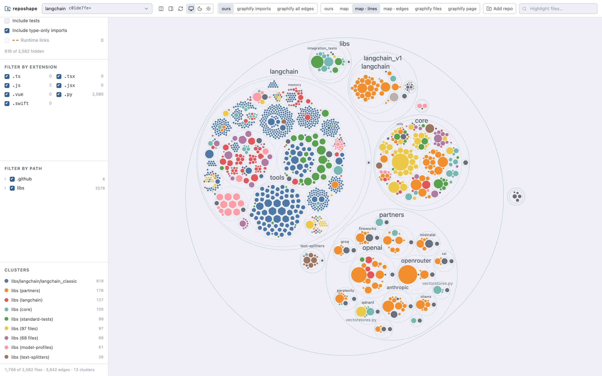
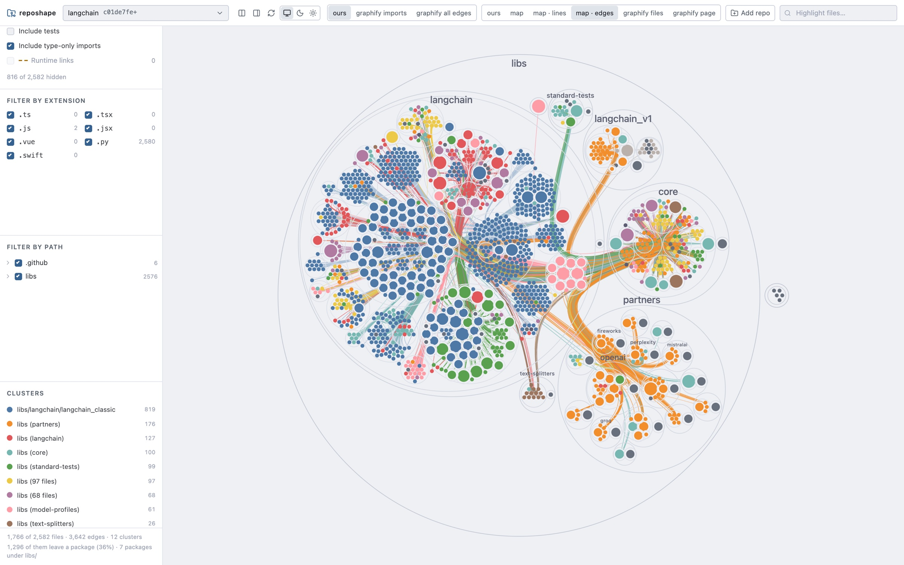

# reposhape

reposhape draws a map of a codebase: every file, the folder it sits in, and
which files import which. It reads TypeScript, JavaScript, Vue and Python,
runs on your machine, and opens the map in your browser.



*The **folders · size** view of LangChain, 1,766 source files with tests
hidden. Each circle is a folder and each dot is a file, sized by its line
count. Colours are clusters worked out from the imports.*



*The **folders · imports** view: the same repo with the imports that cross
from one package to another drawn on top. 1,296 of its 3,642 imports leave
their package.*

## Install

You need Python 3.14 on macOS or Linux.

```bash
uv tool install reposhape
```

`pipx install reposhape` works too. To try it once without installing
anything, run `uvx reposhape up`.

## Quick start

```bash
cd path/to/your/repo
reposhape up .
```

This analyses the repo, starts a small local server and opens the map:

```
  repo  /home/you/code/my-app  (1,259 files, 3,247 edges)
  open  http://127.0.0.1:7420/?repo=my-app-ee3643bb40cb
```

The server keeps running after you close the terminal. `reposhape down`
stops it.

For a repo you don't have locally, pass its URL:

```bash
reposhape up https://github.com/langchain-ai/langchain
```

## Views

The tabs at the top are grouped by what they show.

**Files** are reposhape's own analysis: every file and the imports between
them.

- **import graph**: each file is a dot and each import a line, pulled together
  by a force layout.
- **folders**: files packed into the circles of their folders, one dot each.
- **folders · size**: the same, with each dot's area set by the file's line
  count.
- **folders · imports**: the folders, with the imports that leave their
  package drawn on top.

**Symbols** are functions, classes and methods, and the calls between them.
reposhape doesn't extract these itself. The **symbol graph** tab shows the page
[graphify](https://pypi.org/project/graphifyy/) draws for the repo, once you
have run `reposhape graphify-page` with graphify installed.

The sidebar filters by tests, file type and folder, and the search box
highlights matching files. The split button puts any two views side by side.

## Commands

| Command | What it does |
| --- | --- |
| `reposhape up .` | Analyse the current repo and open its map |
| `reposhape up <url>` | Clone a repo, analyse it and open its map |
| `reposhape up` | Open the page on the repo picker |
| `reposhape up . --refresh` | Re-analyse instead of using the cached result |
| `reposhape status` | Show whether the server is running, and where |
| `reposhape down` | Stop the server |
| `reposhape repos` | List the repos you have analysed |
| `reposhape forget <path>` | Remove a repo's analysis (its files are left alone) |
| `reposhape graphify-page .` | Build the symbol graph with graphify (needs graphify installed) |

`reposhape <command> --help` has the details.

## Choosing what counts as your code

Anything your `.gitignore` skips, reposhape skips too. To hide more, like
vendored libraries or generated code, add a `.reposhapeignore` file to the
repo. It uses the same syntax as `.gitignore`. There's a starting point in
[`.reposhapeignore.example`](.reposhapeignore.example).

## Where it keeps things

- **Analyses** are cached in `~/.cache/reposhape`.
- **Cloned repos** go to `~/.local/share/reposhape/clones/<host>/<owner>/<name>`.
  They are shallow clones and stay until you delete them.
  `REPOSHAPE_CLONE_ROOT` moves them.
- **Settings** come from `REPOSHAPE_*` environment variables. A `.env` file
  inside the repo being analysed is never read.

## Privacy

Your code is parsed locally with tree-sitter. No LLM and no outside service
is involved.

The server only listens on 127.0.0.1. It also rejects requests that come from
another host name or another website, so a page open in your browser can't
read your files through it.

## Upgrading

```bash
uv tool upgrade reposhape
```

The next `reposhape up` notices the server is on the old version and restarts
it.

## Hosting a read-only copy

Set `REPOSHAPE_READ_ONLY=true` to serve a fixed set of repos to other people.
In this mode nobody can browse folders, clone, analyse or forget. The
`Dockerfile` and `compose.release.yaml` build and run that setup, and
`just release` deploys it over SSH using `ops/deployments/hosted.env` (copy
it from `hosted.env.example`). [ADR-0008](docs/adr/0008-one-artifact-two-deliveries.md)
has the details.

## Development

You need uv, pnpm and [just](https://github.com/casey/just).

```bash
just install       # build the page and put `reposhape` on PATH from this checkout
just check         # lint, types, tests, contracts and the static export
just web           # frontend dev server with hot reload
just web-export    # rebuild the page the Python package serves
just package-smoke # build the wheel and sdist, install each and try it
```

The frontend is a static export bundled into the Python package, so nothing
needs Node at run time.

[`PRD.md`](PRD.md) explains what reposhape is for, [`SPEC.md`](SPEC.md) how
it is built, and [`docs/adr/`](docs/adr/) the decisions behind it.

## License

MIT. See [`LICENSE`](LICENSE).
